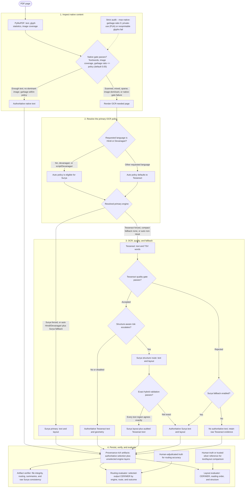

<div align="center">
  <h1>STTL</h1>
  <p><strong>A resumable, page-aware PDF OCR pipeline.</strong></p>
  <p>Route native text efficiently, apply OCR only where it helps, and retain clear provenance for every page.</p>
</div>

STTL inspects each PDF page before choosing native PyMuPDF extraction,
Tesseract, or Surya. Its default `--ocr-engine auto` policy prefers Surya for
OCR-needed Hindi/Devanagari pages while retaining native text whenever it is
usable. A deliberate compact-only profile keeps Hindi on Tesseract and never
loads Surya.

## How it works

The pipeline resolves a route for every page, then persists the evidence needed
to audit both the decision and the selected output. In the diagram, the dotted
input is an operator-selected policy rather than an automatic inference.



The engine switch is deterministic: `auto` selects Surya only when the
requested language is Hindi/Devanagari and the Surya route is enabled; it
does not first run Tesseract or infer Hindi from a confidence score. The
default native-garbage ceiling is `0.05`, which avoids re-OCRing a page for
an isolated extraction artifact. Set it to `0` only for a strict audit, where
even one private-use or nonprintable native glyph must be sent to OCR.

| Capability | What it provides |
| --- | --- |
| Native-first routing | Keeps usable PDF text without rendering or OCRing it. |
| Hindi-aware primary routing | Uses Surya directly for OCR-needed Hindi/Devanagari in auto mode when Surya is enabled. |
| Quality-gated OCR | Uses Tesseract confidence and text-quality signals before escalating on the Tesseract route. |
| Optional structure awareness | Sends table- or column-risk pages to Surya when `--structure-aware` is enabled. |
| Resume-safe output | Appends completed page records so interrupted jobs can continue. |
| Provenance-rich JSON | Preserves native, Tesseract, and Surya evidence separately; structure routes can combine Surya layout with audited Tesseract region text. |
| Artifact verification | Checks that the persisted job, page manifest, summaries, normalized artifacts, and Surya batch evidence agree. |
| Ground-truth evaluation | Scores selected authoritative output rather than silently treating an engine preference as proof of accuracy. |

## Requirements

- Python 3.11. This is the supported local, container, and CI version.
- A `tesseract` executable on `PATH` for pages that take the Tesseract route.
- Hindi Tesseract language data when using the compact Hindi route or
  calibrating Tesseract: use the compact,
  Apache-2.0 [`tessdata_fast` `hin` model](https://github.com/tesseract-ocr/tessdata_fast/blob/4.1.0/hin.traineddata),
  or Tesseract's `script/Devanagari` model for mixed Hindi and English.
- The `surya_ocr` CLI for the accuracy-first Hindi/Devanagari route, Surya
  fallback, or structure-aware routing.
- `pdftotext` only when creating silver ground truth with `create_ground_truth.py`.

Create a standard local environment—never commit it. The project’s old local
environment path was named `sttl/`; use `.venv/` instead so it cannot collide
with the importable package:

```bash
python3.11 -m venv .venv
source .venv/bin/activate
python -m pip install --upgrade pip
python -m pip install -r requirements.lock
python -m pip install --no-deps --no-build-isolation -e .

# requirements-dev.txt records the editable development-tool inputs used to
# regenerate requirements.lock; the lock installs those exact tool versions.

# Install this for the Surya primary/fallback route.
python -m pip install -r requirements-ocr.txt
```

Install Tesseract (and Poppler for `pdftotext`) with your platform's package
manager, then confirm the required executables are available on `PATH`.

## Hindi OCR: accuracy-first Surya, with a compact CPU option

For OCR-needed Hindi or Devanagari pages, the default `--ocr-engine auto`
selects Surya as the primary OCR engine when `--fallback-engine surya` is
enabled (the default). This selection happens *after* the native-text
inspection, so a usable native text layer remains native and is not re-OCRed.
The switch is based on the requested script (`hin`, `devanagari`, or
`script/Devanagari`), rather than a confidence threshold: it targets Surya's
selected Hindi/Devanagari route without spending its resources on English-only
or already-usable native pages. It is a routing preference, not an accuracy
claim: confirm it with human-reviewed ground truth for the document types and
fields that matter to the deployment.

Surya is accuracy-first, not lightweight. The current cached model assets are
about 1.4 GiB before runtime/KV-cache memory and, depending on its backend,
may use Metal/GPU. Install `requirements-ocr.txt` only when that resource
profile is acceptable. Its code is Apache-2.0, but the installed model-weight
metadata identifies a modified OpenRAIL-M license; confirm that license and
any applicable commercial terms before a medical deployment. For a strictly
CPU-only, small-model route, explicitly force Tesseract and disable fallback
as shown below.

If you choose the compact route, install Hindi Tesseract data and verify that
it is visible before processing:

```bash
tesseract --list-langs
```

The output must include `hin` for Hindi-only documents. For code-mixed Hindi
and English, install Tesseract's `script/Devanagari` data and use that single
script model. On Debian/Ubuntu the Hindi package is commonly named
`tesseract-ocr-hin`; Homebrew provides `tesseract-lang`. Package names vary,
so the command above is the authoritative system-wide check.

To avoid a system-wide package installation, place the official compact model
in STTL's ignored local model directory instead:

```bash
mkdir -p models/tessdata
curl --fail --location \
  https://raw.githubusercontent.com/tesseract-ocr/tessdata_fast/4.1.0/hin.traineddata \
  --output models/tessdata/hin.traineddata
tesseract --list-langs --tessdata-dir models/tessdata
```

`--tessdata-dir` must name the directory that directly contains
`hin.traineddata`. A local `script/Devanagari` model instead belongs at
`models/tessdata/script/Devanagari.traineddata`.

Run Hindi-only documents on the accuracy-first default route:

```bash
python pdf_pipeline.py inputs --output-dir artifacts/ocr-hindi-surya \
  --language hin --ocr-engine auto --fallback-engine surya
```

Use `--ocr-engine surya` to force Surya regardless of the requested language.
Use that override only when the larger model and runtime are intended.

To see the switch before running any OCR, use `--dry-run`. Its JSON reports
the resolved `primary_ocr_engine` plus planned Surya- and Tesseract-primary
page counts; it does not start either OCR engine.

The native-text gate remains intentionally separate from the engine choice.
If a document's embedded Hindi uses private-use glyphs or otherwise cannot be
trusted, use the explicit strict audit profile below; `0` means that even one
non-whitespace garbage glyph routes the page to OCR. This can greatly increase
the number of heavyweight Surya pages, so confirm the dry-run count before
using it across a corpus:

```bash
python pdf_pipeline.py inputs --dry-run --language hin \
  --ocr-engine auto --fallback-engine surya \
  --max-native-garbage-ratio 0
```

For a bounded CPU-only Hindi run, force the compact Tesseract-only route:

```bash
python pdf_pipeline.py inputs --output-dir artifacts/ocr-hindi \
  --language hin --tessdata-dir models/tessdata \
  --ocr-engine tesseract --fallback-engine none
```

For a compact Hindi-and-English run, install the separate script model first,
then use the same local data directory:

```bash
mkdir -p models/tessdata/script
curl --fail --location \
  https://raw.githubusercontent.com/tesseract-ocr/tessdata_fast/4.1.0/script/Devanagari.traineddata \
  --output models/tessdata/script/Devanagari.traineddata
python pdf_pipeline.py inputs --output-dir artifacts/ocr-hindi-mixed \
  --language script/Devanagari --tessdata-dir models/tessdata \
  --ocr-engine tesseract --fallback-engine none
```

Alternatively, if both `hin.traineddata` and `eng.traineddata` are in the
same local directory, use `--language hin+eng`. Record the exact model hashes
in the benchmark report and compare that bundle with `script/Devanagari` on
reviewed code-mixed pages before standardizing on either setting.

The compact configuration, `--ocr-engine tesseract --fallback-engine none`,
is deliberately conservative: if Tesseract fails its quality gate, STTL
records the raw candidate as unselected evidence in the rich artifact and
emits no authoritative text for that page. It never starts Surya or silently
treats a known low-quality transcription as final output. In `auto` mode,
`--fallback-engine none` also selects this Tesseract route for Hindi. The
compact profile does not need `requirements-ocr.txt` and cannot use
`--structure-aware`, which requires Surya layout extraction. Structure-aware
hybrid routing is Tesseract-first; use `--ocr-engine tesseract` with
`--fallback-engine surya` when it is needed.

### Hindi OCR choices

| Model | Use in STTL | Size / runtime | License |
| --- | --- | --- | --- |
| [Surya OCR 0.22.1](https://github.com/datalab-to/surya) | Accuracy-first primary for OCR-needed Hindi/Devanagari under auto mode | About 1.4 GiB cached assets before runtime memory; may use Metal/GPU | Code: Apache-2.0. Model weights: modified OpenRAIL-M; review its commercial-use terms before deployment. |
| Tesseract 5 `tessdata_fast` `hin` | Explicit compact Hindi-only route (`--ocr-engine tesseract --fallback-engine none`) | 1.07 MB model, CPU | Apache-2.0 |
| [Tesseract `script/Devanagari`](https://tesseract-ocr.github.io/tessdoc/Command-Line-Usage.html) | Explicit compact mixed Hindi/English route | CPU | Apache-2.0 |
| [PaddleOCR mobile pair](https://www.paddleocr.ai/main/en/version3.x/pipeline_usage/OCR.html) | Candidate CPU fallback if a benchmark shows Tesseract is insufficient | 4.7 MB + 7.5 MB weights | Apache-2.0 |

PaddleOCR's mobile Devanagari recognizer supports Hindi and English, but STTL
does not auto-install it or switch to PaddleOCR yet: that would add a new
runtime and model download without an accuracy benchmark on the target
documents. If it is added, pin the mobile detector explicitly—rather than the
larger generic server detector—and run it with `device="cpu"`. Avoid
PaddleOCR-VL, EasyOCR's PyTorch stack, and IndicOCR for this profile; they are
materially heavier than the compact Tesseract path.

### Calibrate the acceptance gate; do not guess

The built-in quality thresholds are starting policy, not a claim of medical
accuracy. Tesseract can assign high confidence to a visually wrong Hindi word,
especially in decorative headers, small text, dates, or mixed-script pages.
Before changing a threshold, collect human-adjudicated transcription and an
independent reviewer decision about whether the raw Tesseract candidate is
safe to auto-accept under a written field policy.

Run every development page through Tesseract once in compact-only mode so that
the rich artifact retains raw, non-authoritative evidence for both accepted and
rejected pages:

~~~bash
python pdf_pipeline.py calibration/development-pdfs --output-dir artifacts/calibration/dev-run \
  --language hin --tessdata-dir models/tessdata \
  --ocr-engine tesseract --fallback-engine none \
  --min-native-chars 1000000000 --min-native-words 1000000000 --no-resume
~~~

For a code-mixed corpus, use the compact script/Devanagari pack described
above instead of Hindi-only language data. Keep the resulting rich artifact
local. It contains document content.

For each document, create a reviewed truth file. The source digest prevents
accidentally joining a transcription to a different PDF, and the Tesseract
evidence digest prevents reusing a raw-candidate safety label after a model or
OCR run changes:

~~~json
{
  "schema_version": "sttl-human-transcription/v1",
  "document_id": "opaque-report-001",
  "source_sha256": "<job.json source.content_sha256>",
  "tesseract_evidence_sha256": "<SHA-256 of the linked rich JSON>",
  "pages": [
    {
      "page": 1,
      "text": "Human-adjudicated transcription in intended reading order",
      "review": {
        "status": "adjudicated",
        "auto_accept": false,
        "reasons": ["critical_field_error"]
      }
    }
  ]
}
~~~

Keep development and held-out test manifests document-disjoint:

~~~json
{
  "schema_version": "sttl-gate-calibration-corpus/v1",
  "split": "development",
  "documents": [
    {
      "id": "opaque-report-001",
      "ocr_json": "../dev-run/report-001/report-001_rich.json",
      "human_truth_json": "../truth/report-001.json"
    }
  ]
}
~~~

Replay candidate confidence gates without re-running OCR:

~~~bash
python calibrate_tesseract_gate.py \
  --corpus calibration/development.json \
  --out-dir artifacts/calibration/development-report \
  --max-false-accepts 0 \
  --candidate current:65:0.70:60 \
  --candidate cautious:80:0.85:75
~~~

The JSON and CSV report show false accepts, false rejects, coverage,
accepted-only CER/WER, and the Pareto frontier. It only ranks candidates under
the predeclared development constraint; it never alters production defaults.
Freeze one candidate, then evaluate it exactly once on a separate
"split": "test" manifest. Report denominators (for example, “zero observed
false accepts out of 40 unsafe pages”), not a safety claim from a small sample.
When the OCR run used non-default sparse, garbage, or plausibility controls,
pass the matching fixed options from its job.json to the calibration command.

If a PDF has visibly clear text but its native layer contains private-use
Unicode glyphs, a conservative test profile is available now:

~~~bash
python pdf_pipeline.py inputs --dry-run --max-native-garbage-ratio 0
~~~

It routes any non-whitespace native garbage, including those private-use
glyphs, to local OCR. Measure its added CPU cost and reviewed error rate on the
development corpus before adopting it as a permanent policy.

## Quick start

Put input documents in the ignored `inputs/` directory, then inspect routing
before doing OCR:

```bash
mkdir -p inputs
python pdf_pipeline.py inputs --dry-run
```

Process a local folder into an ignored artifact directory:

```bash
python pdf_pipeline.py inputs --output-dir artifacts/ocr-default

# For layouts where table and multi-column structure matter:
python pdf_pipeline.py inputs --output-dir artifacts/ocr-structure --structure-aware

# Keep Surya's own text on those structure routes if comparison is preferred:
python pdf_pipeline.py inputs --output-dir artifacts/ocr-structure-surya-text --structure-aware --no-structure-hybrid-text
```

Use `--shard-count` and `--shard-index` to select deterministic subsets of a
large corpus. Let each worker write to a separate output root if it needs its
own batch summary.

## Output

For `inputs/report.pdf`, STTL writes a local job directory such as:

```text
artifacts/ocr/report/
├── job.json                 path-free source fingerprint and pipeline policy
├── pages.jsonl              completed page records used for resume
├── document.json            document-level routing summary
├── combined.txt             authoritative text after completion
├── report_cascade.json      normalized page-oriented artifact
├── report_rich.json         multi-layer provenance-preserving artifact
└── surya/                   raw primary or fallback output when Surya is used
```

`report_rich.json` keeps native PDF spans, Tesseract word geometry, and Surya
blocks in separate layers. A direct Hindi/Devanagari Surya-primary page marks
Tesseract as unattempted and selects Surya as the authoritative layer. On a
quality-accepted, Tesseract-first structure escalation, it can instead use
Surya regions and high-confidence overlapping Tesseract words. Each
hybridized authoritative block records its layout engine, text engine, original
Surya text, selected Tesseract word orders, and content/order agreement. A
hybrid applies only when every textual Surya region has the exact canonical
Tesseract token sequence, with no unassigned high-confidence words. Tables are
re-ordered from word geometry; signed and numeric values must also match.
Otherwise the page remains pure Surya. The raw engine layers remain unselected
evidence and explicitly record what they contributed to the top-level
`authoritative` result. The unchanged Surya result keeps its HTML and parsed
table cells as structural evidence, while authoritative block text is marked
as Tesseract-derived.

Job fingerprints store a basename, size, and SHA-256 digest instead of an
absolute input path. Artifacts still contain extracted document content, so
they remain local by default.

## Verify and evaluate an OCR run

### Verify the persisted artifact first

Run the verifier against one completed STTL job directory before reading its
OCR result as evidence. Replace `JOB_DIR` with that directory (for example,
`artifacts/ocr/report`):

```bash
.venv/bin/python verify_ocr_artifact.py JOB_DIR \
  --json-out verification.json
```

It exits nonzero on an error and emits a JSON report with `valid`, `errors`,
`warnings`, and `checks`. It cross-checks `job.json`, the effective page
manifest, `document.json`, `combined.txt`, normalized/rich exports, route and
outcome contracts, summary counters, block geometry/order, and retained raw
Surya batch results. A passing verifier establishes artifact integrity and
provenance—not OCR accuracy. Keep `--allow-incomplete` and
`--allow-missing-raw-surya` for deliberate recovery diagnostics only; they
downgrade those missing-evidence conditions to warnings.

### Evaluate the routing decision against reviewed text

After a successful verification, test the Hindi policy itself—not just
whether an artifact is well-formed—by scoring a reviewed sample with
`evaluate_routing.py`. It accepts the
`sttl-human-transcription/v1` truth format shown in the
[calibration section](#calibrate-the-acceptance-gate-do-not-guess). Every
included page must be adjudicated, and the truth file's source SHA-256 must
match the sibling `job.json`; this prevents a transcription from being joined
to the wrong PDF.

```bash
.venv/bin/python evaluate_routing.py \
  --rich-json JOB_DIR/<stem>_rich.json \
  --human-truth truth.json \
  --job-json JOB_DIR/job.json \
  --out-dir evaluation/
```

Replace `<stem>` with the document artifact's filename stem, such as
`report`. The explicit `--job-json` binds the truth file to the source
fingerprint used for the run.

The report writes `routing_evaluation.json` and `routing_per_page.csv`. It
reports exact CER/WER for the selected authoritative output, stratified by engine,
route, and outcome such as `surya_primary`,
`tesseract_accepted`, or `native_text_accepted`. This is the check for the
actual claim behind the policy: whether reviewed Hindi pages routed to Surya
perform acceptably for the document types in scope. It is not a substitute
for a held-out sample or a clinical-safety validation.

### Evaluate text and layout against a reference

Create a local silver reference from a document you are allowed to process:

```bash
python create_ground_truth.py inputs/report.pdf --output-dir artifacts/ground_truth
```

Then evaluate the authoritative cascade output:

```bash
python evaluate_ocr.py \
  --reference artifacts/ground_truth/reference.json \
  --structure artifacts/ground_truth/structure.json \
  --engine cascade \
  --ocr-json artifacts/ocr/report/report_rich.json \
  --out-dir artifacts/evaluation/cascade
```

### Fair cascade-versus-Chandra comparison

Use a fixed, rights-cleared corpus and the same reference/structure JSON for
both engines. `create_ground_truth.py` produces a *silver* reference from an
embedded PDF text layer, so it is suitable only when that layer is trustworthy.
For image-only Hindi scans, use independently reviewed human transcription and
structure annotations instead; do not score either OCR engine against another
OCR-like extraction.

For a compact Hindi run and one hosted Chandra run on the same PDF:

```bash
# STTL: local, CPU-only Hindi profile
python pdf_pipeline.py inputs/report.pdf --output-dir artifacts/bench/sttl \
  --language hin --tessdata-dir models/tessdata \
  --ocr-engine tesseract --fallback-engine none --no-resume

# Chandra: hosted; requires DATALAB_API_KEY and uploads the PDF externally.
python run_chandra.py inputs/report.pdf --output-dir artifacts/bench/chandra \
  --mode accurate

# Score both outputs against the exact same reference and structure files.
# Text-only matching keeps layout evidence symmetric until Chandra coordinates
# are normalized into the evaluator's PDF-point coordinate frame.
python evaluate_ocr.py \
  --reference artifacts/ground_truth/reference.json \
  --structure artifacts/ground_truth/structure.json \
  --engine cascade \
  --ocr-json artifacts/bench/sttl/report/report_rich.json \
  --matching-evidence text-only \
  --out-dir artifacts/bench/evaluation/cascade

python evaluate_ocr.py \
  --reference artifacts/ground_truth/reference.json \
  --structure artifacts/ground_truth/structure.json \
  --engine chandra \
  --ocr-json artifacts/bench/chandra/report_chandra.json \
  --matching-evidence text-only \
  --out-dir artifacts/bench/evaluation/chandra

python compare_ocr.py \
  --cascade artifacts/bench/evaluation/cascade/cascade_evaluation.json \
  --chandra artifacts/bench/evaluation/chandra/chandra_evaluation.json \
  --out artifacts/bench/evaluation/comparison.json
```

The comparison tool verifies the reference and structure SHA-256 values,
matching policy, engine labels, page count, and exact evaluated page IDs before
declaring a winner. Older reports lack this provenance and therefore produce no
winners unless `--allow-unverified` is explicitly supplied. It compares
reading order only on pages measured by both engines. Geometry-enabled layout
evaluations deliberately leave structure and reading-order winners
inconclusive; rerun both with `--matching-evidence text-only` as above.

This command intentionally benchmarks the compact Tesseract profile, not the
default Hindi auto/Surya route. For an accuracy-first Surya-versus-Chandra
comparison, run the same corpus with `--ocr-engine surya`, keep every other
routing option fixed, and report it as a separate configuration.

STTL's normal route is native-text-first, while Chandra processes the entire
PDF. Treat that as a valid end-to-end comparison, but report a separate
OCR-only diagnostic if needed by adding
`--min-native-chars 1000000000 --min-native-words 1000000000` to the STTL
command. Do not score a rejected compact-only Tesseract candidate as final
text: its empty authoritative result is intentional and its raw candidate is
audit evidence only.

`benchmark.py` records local command wall time, CPU, RAM, and macOS GPU
sampling. Chandra's client wall time, provider runtime, and cost from its
`*_timing.json` are useful operational measures, but they are not comparable
to STTL's local GPU/CPU usage. `run_chandra.py` is an optional hosted OCR
adapter; it uploads the supplied PDF to an external service, so review that
provider's current terms, cost, and data handling before using it.

Structure scores use evidence-backed one-to-one block matches rather than
label counts. Reading-order results include match coverage and are marked
inconclusive when coverage is too low; bbox evidence is used only when both
artifacts declare the same normalized PDF coordinate frame.

## Test

The test suite uses synthetic PDFs and does not need a model download, service
credential, or private document:

```bash
make test
# or: python -m pytest
```

The full CI suite runs all `test_*.py` files, Ruff lint/format checks, a
gradual mypy gate for extracted typed modules and the benchmark module, and
coverage reporting. Run the same checks locally with `make check` and
`make coverage`.

## Container image

The Docker image uses Python 3.11, Tesseract (including English and Hindi
language data), and Poppler. Its default compact image is locked; Surya is an
explicit optional layer because its runtime/model dependencies are large. The
build context intentionally excludes local documents, artifacts, credentials,
and model caches.

```bash
docker build --tag sttl .
# Add Surya for the accuracy-first Hindi route:
docker build --build-arg INSTALL_SURYA=1 --tag sttl-surya .
```

## Privacy and publishing

This repository intentionally excludes PDFs, screenshots, OCR outputs, raw
provider responses, logs, ground truth derived from documents, virtual
environments, and local credentials. Review a file's privacy and redistribution
rights before adding it, including macOS extended attributes that can retain
download provenance or signed URLs. The checked-in `.gitignore` protects the
common local directories, but it is not a substitute for review.

## Repository guide

| Path | Purpose |
| --- | --- |
| `pdf_pipeline.py` | Backwards-compatible CLI shim for `src/sttl/pipeline.py`. |
| `verify_ocr_artifact.py` | Verifies persisted artifact integrity, routing, and provenance contracts. |
| `evaluate_ocr.py` | Backwards-compatible CLI shim for `src/sttl/evaluate.py`. |
| `evaluate_routing.py` | Human-truth CER/WER, stratified by selected engine, route, and outcome. |
| `calibrate_tesseract_gate.py` | Replays reviewed raw Tesseract evidence against candidate acceptance gates. |
| `create_ground_truth.py` | Generates local silver references from a PDF. |
| `run_chandra.py` | Optional hosted OCR adapter and normalizer. |
| `benchmark.py`, `compare_ocr.py` | Benchmark capture and comparison utilities. |
| `test_pdf_pipeline.py` | Synthetic unit coverage. |
| `src/sttl/` | Typed shared utilities and the incremental package migration target. |
| `pyproject.toml`, `requirements-dev.txt`, `Makefile` | Package metadata and local quality commands. |
| `.github/` | CI, Dependabot, issue forms, and PR checklist. |

## Contributing and security

Please read [CONTRIBUTING.md](CONTRIBUTING.md) before opening a pull request and
[SECURITY.md](SECURITY.md) before reporting a vulnerability.

## License

No license has been selected yet. Add one before publishing this project for
reuse or accepting contributions under defined terms.
