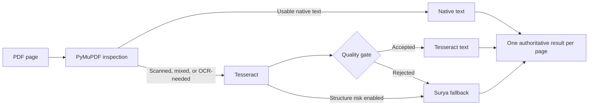

<div align="center">
  <h1>STTL</h1>
  <p><strong>A resumable, page-aware PDF OCR pipeline.</strong></p>
  <p>Route native text efficiently, apply OCR only where it helps, and retain clear provenance for every page.</p>
</div>

STTL inspects each PDF page before choosing native PyMuPDF extraction,
Tesseract, or an optional Surya fallback. It is designed for local document
processing where a one-size-fits-all OCR pass would be unnecessarily expensive
or would obscure where output came from.

## How it works



| Capability | What it provides |
| --- | --- |
| Native-first routing | Keeps usable PDF text without rendering or OCRing it. |
| Quality-gated OCR | Uses Tesseract confidence and text-quality signals before escalating. |
| Optional structure awareness | Sends table- or column-risk pages to Surya when `--structure-aware` is enabled. |
| Resume-safe output | Appends completed page records so interrupted jobs can continue. |
| Provenance-rich JSON | Preserves native, Tesseract, and Surya evidence separately while selecting one result per page. |

## Requirements

- Python 3.10 or newer; continuous integration runs on Python 3.11.
- A `tesseract` executable on `PATH` for pages that take the Tesseract route.
- The optional `surya_ocr` CLI for Surya fallback.
- `pdftotext` only when creating silver ground truth with `create_ground_truth.py`.

Create a standard local environment—never commit it:

```bash
python3 -m venv .venv
source .venv/bin/activate
python -m pip install --upgrade pip
python -m pip install -r requirements.txt

# Install this only when the Surya fallback is needed.
python -m pip install -r requirements-ocr.txt
```

Install Tesseract (and Poppler for `pdftotext`) with your platform's package
manager, then confirm the required executables are available on `PATH`.

## Quick start

Put input documents in the ignored `inputs/` directory, then inspect routing
before doing OCR:

```bash
mkdir -p inputs
python pdf_pipeline.py inputs --dry-run
```

Process a local folder into an ignored artifact directory:

```bash
python pdf_pipeline.py inputs --output-dir artifacts/ocr

# For layouts where table and multi-column structure matter:
python pdf_pipeline.py inputs --output-dir artifacts/ocr --structure-aware
```

Use `--shard-count` and `--shard-index` to select deterministic subsets of a
large corpus. Let each worker write to a separate output root if it needs its
own batch summary.

## Output

For `inputs/report.pdf`, STTL writes a local job directory such as:

```text
artifacts/ocr/report/
├── job.json                 path-free source fingerprint and pipeline policy
├── pages.jsonl              completed page records used for resume
├── document.json            document-level routing summary
├── combined.txt             authoritative text after completion
├── report_cascade.json      normalized page-oriented artifact
├── report_rich.json         multi-layer provenance-preserving artifact
└── surya/                   raw fallback output when Surya is used
```

`report_rich.json` keeps native PDF spans, Tesseract word geometry, and Surya
blocks in separate layers. The `authoritative` layer is the single selected
result for a page; it does not concatenate competing OCR outputs.

Job fingerprints store a basename, size, and SHA-256 digest instead of an
absolute input path. Artifacts still contain extracted document content, so
they remain local by default.

## Evaluate an OCR run

Create a local silver reference from a document you are allowed to process:

```bash
python create_ground_truth.py inputs/report.pdf --output-dir artifacts/ground_truth
```

Then evaluate the authoritative cascade output:

```bash
python evaluate_ocr.py \
  --reference artifacts/ground_truth/reference.json \
  --structure artifacts/ground_truth/structure.json \
  --engine cascade \
  --ocr-json artifacts/ocr/report/report_rich.json \
  --out-dir artifacts/evaluation/cascade
```

`benchmark.py` records runtime samples for a command, and `compare_ocr.py`
compares two saved evaluation results. `run_chandra.py` is an optional hosted
OCR adapter; it uploads the supplied PDF to an external service, so review that
provider's current terms, cost, and data handling before using it.

## Test

The test suite uses synthetic PDFs and does not need a model download, service
credential, or private document:

```bash
python -m unittest -v test_pdf_pipeline.py
```

## Privacy and publishing

This repository intentionally excludes PDFs, screenshots, OCR outputs, raw
provider responses, logs, ground truth derived from documents, virtual
environments, and local credentials. Review a file's privacy and redistribution
rights before adding it, including macOS extended attributes that can retain
download provenance or signed URLs. The checked-in `.gitignore` protects the
common local directories, but it is not a substitute for review.

## Repository guide

| Path | Purpose |
| --- | --- |
| `pdf_pipeline.py` | Main routing and OCR pipeline. |
| `evaluate_ocr.py` | CER, WER, reading-order, and structural evaluation. |
| `create_ground_truth.py` | Generates local silver references from a PDF. |
| `run_chandra.py` | Optional hosted OCR adapter and normalizer. |
| `benchmark.py`, `compare_ocr.py` | Benchmark capture and comparison utilities. |
| `test_pdf_pipeline.py` | Synthetic unit coverage. |
| `.github/` | CI, Dependabot, issue forms, and PR checklist. |

## Contributing and security

Please read [CONTRIBUTING.md](CONTRIBUTING.md) before opening a pull request and
[SECURITY.md](SECURITY.md) before reporting a vulnerability.

## License

No license has been selected yet. Add one before publishing this project for
reuse or accepting contributions under defined terms.
